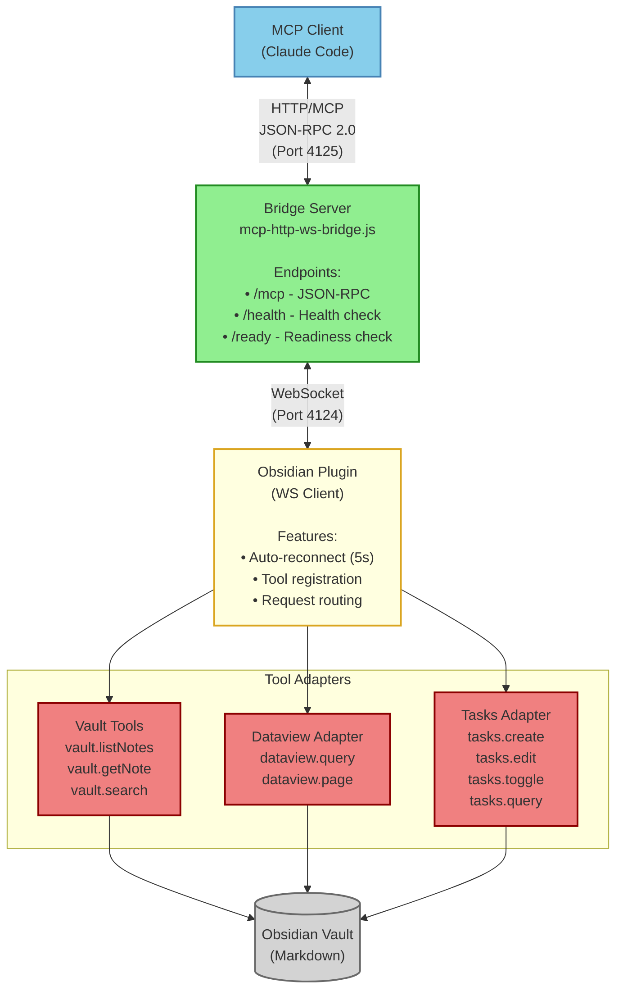

# Architecture

This document explains the technical architecture of the Obsidian MCP Connector plugin.

## Overview

The plugin uses a **unified WebSocket architecture** that works across all platforms (Desktop and Mobile):

- Plugin connects as WebSocket client to an external bridge server
- Bridge server exposes HTTP/MCP endpoint for MCP clients
- No platform-specific transport layers required

## Architecture Diagram



## Component Layers

### 1. MCP Client Layer
- Connects via HTTP to port 4125
- Sends JSON-RPC 2.0 requests (tools/list, tools/call)
- Receives tool results and descriptions
- Examples: Claude Code, custom MCP clients

### 2. Bridge Server Layer (`mcp-http-ws-bridge.js`)
- **HTTP Server** (Port 4125): Accepts MCP client connections
- **WebSocket Server** (Port 4124): Accepts Obsidian plugin connection
- **Translation**: Converts HTTP/JSON-RPC ↔ WebSocket messages
- **Endpoints**:
  - `/mcp` - MCP JSON-RPC endpoint
  - `/health` - Health check (always 200)
  - `/ready` - Readiness check (503 until Obsidian connects)

### 3. Obsidian Plugin Layer (`plugin-bridge.ts`)
- Connects as WebSocket client to bridge server
- Auto-reconnects every 5 seconds if disconnected
- Registers all available tools with descriptions
- Routes tool invocations to appropriate adapters

### 4. Tool Adapter Layer
- **Vault Tools**: Direct file operations via Obsidian API
- **Dataview Adapter**: Queries via Dataview plugin API
- **Tasks Adapter**: Task CRUD via Dataview TASK queries + file operations
- Each tool includes comprehensive description with usage guidelines

### 5. Data Layer
- Obsidian vault markdown files
- Dataview inline metadata `[key:: value]`
- Frontmatter YAML metadata

## Data Flow Example

```
1. MCP Client: POST /mcp {"method": "tasks.create", "params": {...}}
2. Bridge Server: Forwards via WebSocket to Obsidian Plugin
3. Plugin Bridge: Routes to TasksAdapter.createTask()
4. Tasks Adapter:
   - Formats task with Dataview metadata
   - Auto-generates [id::] and [created::]
   - Writes to vault file via Obsidian API
5. Plugin Bridge: Returns {file: "path.md", lineNumber: 42}
6. Bridge Server: Forwards response via HTTP
7. MCP Client: Receives task creation confirmation
```

## Platform Support

**Supported Targets:**
- ✅ **Windows** - Full desktop support
- ✅ **macOS** - Full desktop support
- ✅ **Linux** - Full desktop support
- ✅ **Android** - With Termux for bridge server (fully self-contained on device)
- ⚠️ **iOS** - Requires bridge server on separate device (limited support)

## Security

- Bridge server binds to `127.0.0.1` by default (localhost only)
- For network access, use `--host` flag with caution
- WebSocket connection: `ws://127.0.0.1:4124/mcp`
- MCP HTTP endpoint: `http://127.0.0.1:4125/mcp`

## Project Structure

```
src/
├── main.ts                        # Main plugin entry point
├── mcp-websocket.ts               # WebSocket transport (unified for all platforms)
├── plugin-bridge.ts               # Tool registration and Obsidian API bridge
├── settings.ts                    # Plugin settings and UI
└── tools/                         # Tool adapters and utilities
    ├── mcp-http-ws-bridge.js      # WebSocket bridge server (runs separately)
    ├── start-bridge.sh            # Linux/Mac startup script
    ├── start-bridge.cmd           # Windows startup script
    ├── dataview.ts                # Dataview plugin adapter
    └── tasks.ts                   # Tasks plugin adapter with full CRUD
tests/                             # Unit tests
.mcp.json                          # MCP configuration
manifest.json                      # Obsidian plugin manifest
package.json                       # Node.js dependencies and build scripts
tsconfig.json                      # TypeScript configuration
```

## Endpoints

### For Obsidian Plugin
- **WebSocket**: `ws://127.0.0.1:4124/mcp` — Plugin connects here

### For MCP Clients
- **HTTP/JSON-RPC**: `http://127.0.0.1:4125/mcp` — MCP clients connect here
- **Health Check**: `http://127.0.0.1:4125/health` — Check bridge status (always returns 200)
- **Readiness Check**: `http://127.0.0.1:4125/ready` — Check if Obsidian is connected (503 if not ready, 200 if ready)
